# Lszquphsbgjf

**Pavel Škoda** `<p@v3l.cz>`

Twitter: @HeurekaDevs

http://www.heurekadevs.cz

---
# Kryptografie
Převod zprávy do podoby, která není čitelná bez určité znalosti.

---
# Kryptologie
- Kryptografie
- Kryptoanalýza

---
# Steganografie


---
# Šifra
Algoritmus transformace zprávy

---
# Klíč
Informace potřebná k vyluštění zašifrované zprávy

---
# Substituční šifry
Nahrazení každého znaku jiným

A → X<br \>
B → N<br \>
C → M<br \>
&nbsp;... <br \>

---
# Caesarova šifra
Posunutí každého znaku abecedně

 **A** → B → C → **D**<br \>
 **H** → I → J → **K**<br \>
 **O** → P → Q → **R**<br \>
 **J** → K → L → **M**<br \>

---
# Útoky na substituční šifry
- Frekvenční analýza
- Souhláska -> samohláska (Q → U)
- Odhad následujícího slova

---
# Šifra Marie Stuartovny
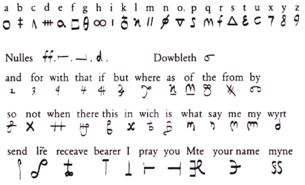

---
# Aditivní šifry
Sčítání zprávy s klíčem

 **A** + K = **K**<br \>
 **H** + L = **S**<br \>
 **O** + I = **W**<br \>
 **J** + C = **L**<br \>

---
# Vernamova šifra (one time pad)
1917 - Gilbert Vernam

---
# Vernamova šifra (one time pad)
 **1** ⊕ 1 = **0**<br \>
 **0** ⊕ 1 = **1**<br \>
 **1** ⊕ 0 = **1**<br \>
 **0** ⊕ 1 = **1**<br \>
 **1** ⊕ 0 = **1**<br \>
 **0** ⊕ 1 = **1**<br \>

---
# (A⊕k)⊕(B⊕k) = A⊕B

---
# Transpoziční šifry
Prohazování pořadí znaků
```
K...T...A...
.R.P.O.R.F.E
..Y...G...I.
```

`KTARPORFEYGI`

---
# Moderní šifry
Kde už nestačí papír a tužka...

---
# Životnost informace
Jak dlouho musí zůstat informace tajná

---
# Symetrické šifry
Stejný klíč na zašifrování i dešifrování zprávy

---
# DES
Data encryption standart

---
# AES
Advanced Encryption Standard

---
# Problém distribuce klíčů
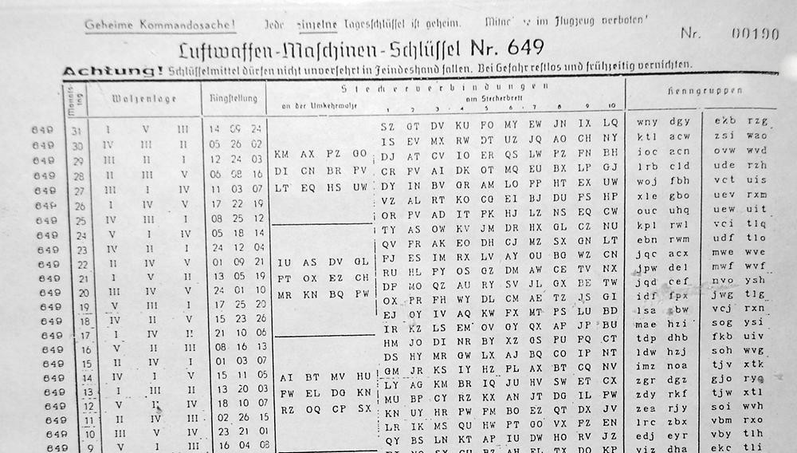

---
# Diffie-Hellman

New directions in cryptography - 1976

---
# RSA

Adi Shamir, Ron Rivest, Leonard Adleman

---
# Asymetrické šifry
Soukromý a veřejný klíč

---
# Jednosměrná funkce
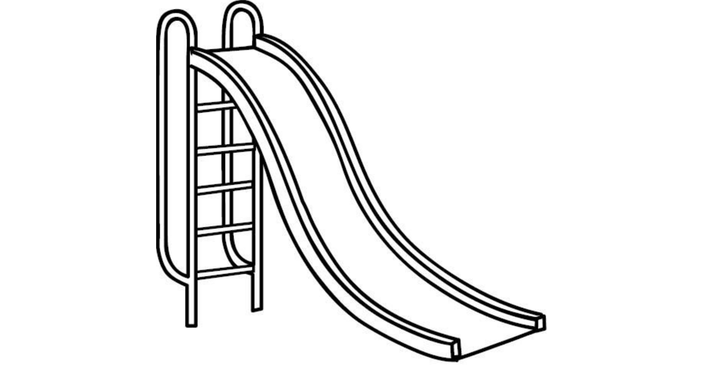

---
# Jednosměrná funkce
Faktorizace vs násobení prvočísel

---
# Podepisování
Podepíšu soukromým klíčem,
veřejným jsem schopen ověřit

---
# Kombinace šifer
Symetrická + Asymetrická

---
# Postranní kanály
Útok na fyzickou implementaci kryptosystému

---
# TLS + Komprimace
```
HTTP/1.1 200 OK
Content-Type: text/html
Set-Cookie: SESSION-ID=123zf09hf012fh2
...

<div id="message">
   Hello, Set-Cookie: SESSION-ID=123
</div>
```

---
# Generátor pseudonáhody
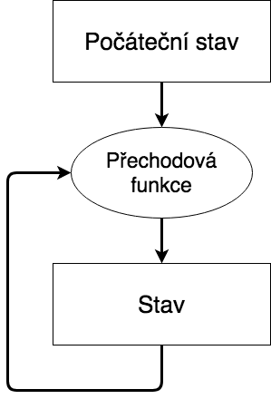

---
# Entropie
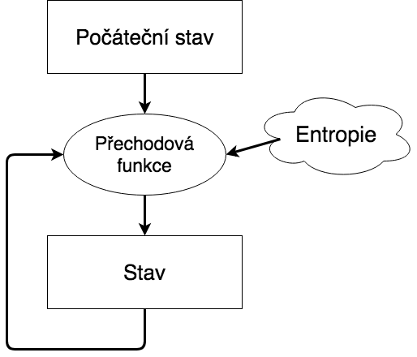

---
# Entropie
```
cat /proc/sys/kernel/random/entropy_avail
```

---
# Vždycky někdo poslouchá

---
# Echelon
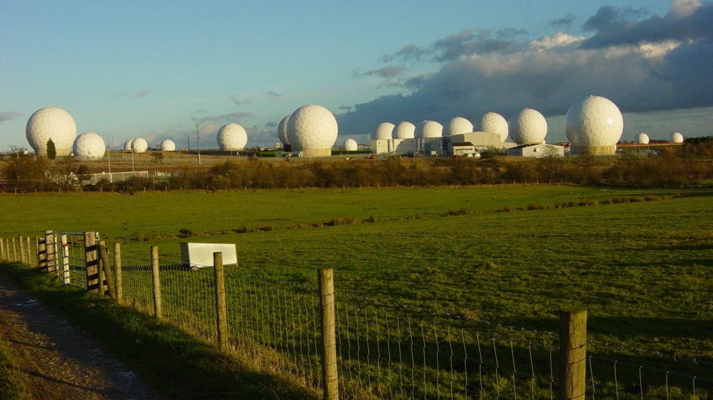

---
# ISP


---
# Cloud


---
# PASSion

---
# PASSion

---
# PASSion
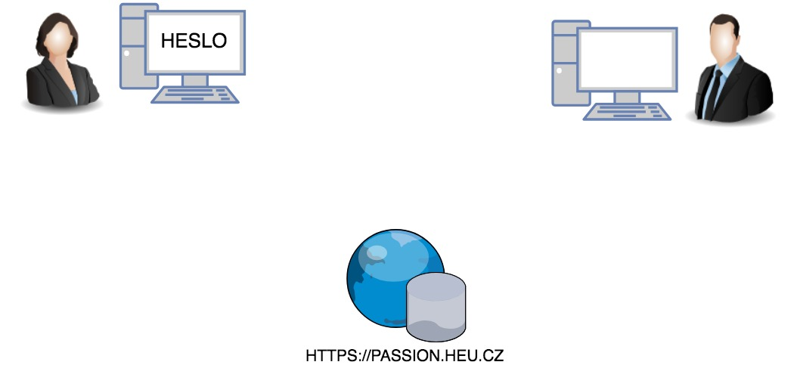
---
# PASSion

---
# PASSion
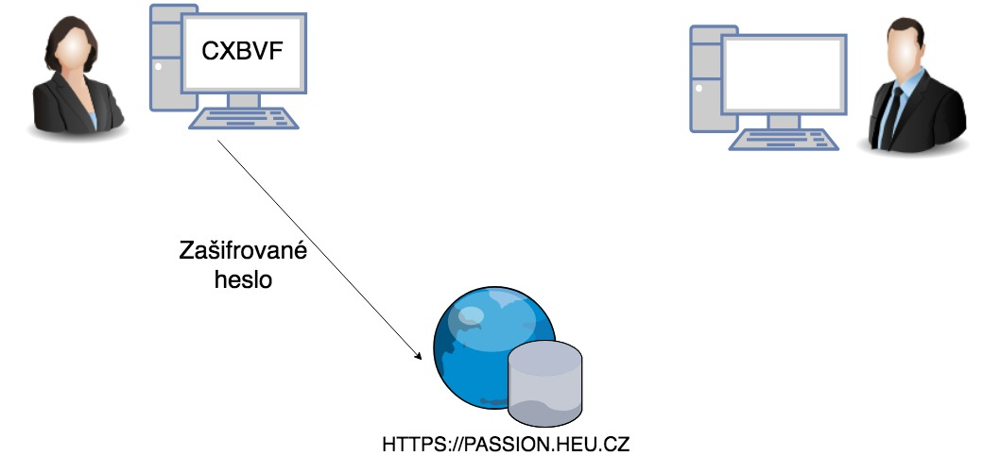
---
# PASSion

---
# PASSion
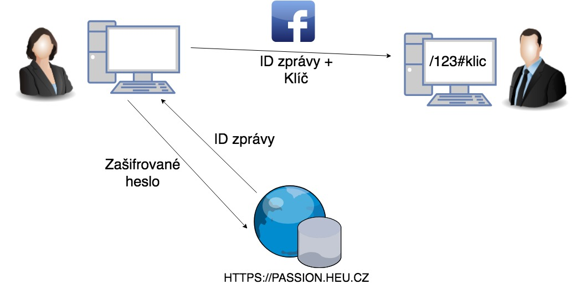
---
# PASSion
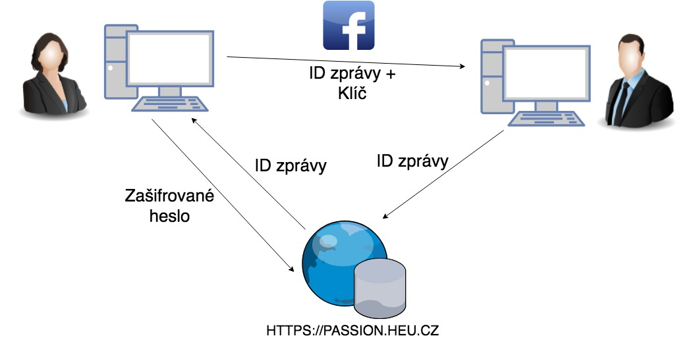
---
# PASSion

---
# PASSion
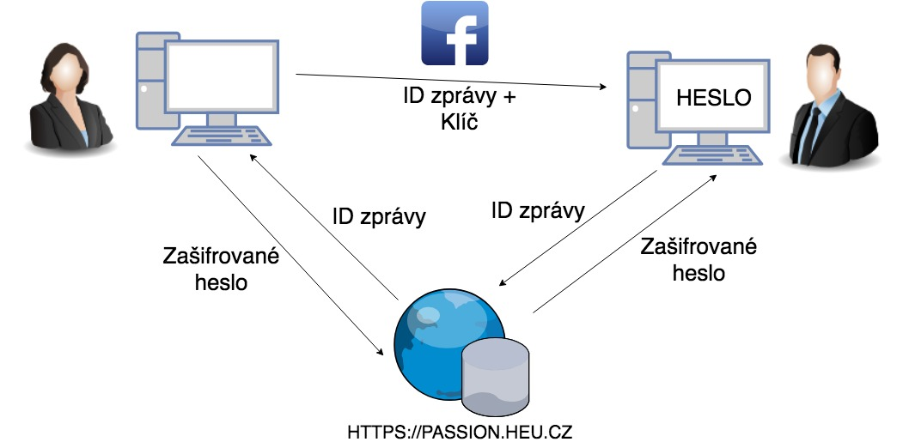
---
# Demo
---
# Děkuji za pozornost
**Pavel Škoda** `<p@v3l.cz>`

Twitter: @HeurekaDevs

http://www.heurekadevs.cz

(https://github.com/heureka/passion)
